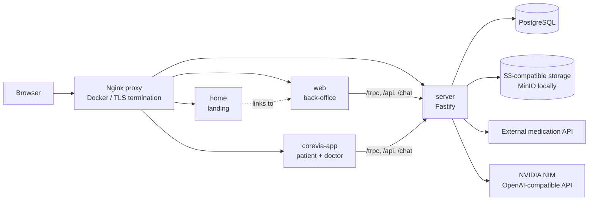

# Corevia architecture

This document describes the architecture that is present in this repository. It is
intentionally limited to components that can be verified in the source tree and
Docker configuration.

## Repository structure

Corevia is a pnpm/Turborepo monorepo:

| Workspace | Responsibility | Runtime |
| --- | --- | --- |
| `apps/home` | Public landing page | React Router/Vite |
| `apps/web` | Back-office application | React Router/Vite |
| `apps/corevia-app` | Patient and doctor application | React Router/Vite |
| `apps/server` | HTTP API, authentication, business services and integrations | Fastify/Node.js |

Shared repository-level concerns include Drizzle migrations and schema, Docker
Compose, the Nginx reverse proxy, CI workflows and quality checks.

## Runtime flow

In local Vite development, `apps/web` and `apps/corevia-app` proxy API paths to
the server on port `3000`; local TLS is enabled when the repository certificates
exist. In the Docker profile, Nginx routes the public hostnames to the frontend
containers and the API container.

## Server composition

`apps/server/src/index.ts` is the process entry point. It creates the application,
initializes the configured S3-compatible bucket, and binds Fastify to `0.0.0.0`
on `PORT` (default `3000`). `apps/server/src/app.ts` assembles the HTTP surface:

- Fastify CORS and Helmet middleware;
- Better Auth at `/api/auth/*`;
- tRPC transport at `/trpc`;
- OpenAPI-compatible tRPC routes under `/api`;
- the AI streaming endpoint at `/chat`;
- `/health` and the generated OpenAPI/Scalar documentation.

The router and service layers sit between HTTP handlers and persistence. Drizzle
uses PostgreSQL in the runtime stack. S3-compatible object storage is used for
files; MinIO is the local Docker implementation. The medication provider adapts
the external medication API into the internal `MedicationSearchResult` model and
uses an in-memory cache. The AI adapter targets an NVIDIA NIM endpoint through an
OpenAI-compatible client.

PGlite is used by the server test setup for isolated tests. It is not the
production database described by Docker Compose. This repository does not contain
a mobile application, Pinecone integration or a separate RAG service.

## Deployment boundary

The repository contains Docker build and deployment workflows for the server and
frontend images, including workflows targeting DigitalOcean. The actual runtime
secrets, infrastructure state and operational access are external to this source
tree. No deployment target is inferred beyond what those workflows and Compose
configuration explicitly declare.

Related documents:

- [Environment reference](ENVIRONMENT.md)
- [API reference](API.md)
- [Testing guide](TESTING.md)
- [Quality acceptance process](quality/QUALITY_ACCEPTANCE_PROCESS.md)
